# ScheduleMate — Lecture Hall Digital Signage System

ScheduleMate is a full-stack system for managing lecture hall schedules and displaying them automatically on digital signage screens outside lecture halls. Admin staff manage buildings, rooms, modules, lecturers and session timetables through a web console, and each physical display device polls a public API to show live "Ongoing / Upcoming / Cancelled / Rescheduled" lecture information for the hallway it's mounted in.

The project has three parts that work together:

| App | Description | Tech |
|---|---|---|
| `apps/api` | Backend REST API — auth, scheduling, conflict validation, signage feed | Node.js, Express, TypeScript, Prisma, PostgreSQL |
| `apps/admin-web` | Admin console used by staff to manage the timetable | React, TypeScript, Vite |
| `apps/signage-display` | Kiosk screen shown on the physical displays | React, TypeScript, Vite |

---

## Table of Contents

- [Features](#features)
- [Screenshots](#screenshots)
- [Tech Stack](#tech-stack)
- [Project Structure](#project-structure)
- [Prerequisites](#prerequisites)
- [Setup & Installation](#setup--installation)
- [Running the Project](#running-the-project)
- [Default Login](#default-login)
- [Usage Guide](#usage-guide)
- [How the Signage Display Works](#how-the-signage-display-works)
- [API Overview](#api-overview)
- [Known Limitations](#known-limitations)
- [Author](#author)

---

## Features

**Admin Console**
- Secure login with JWT authentication and password reset flow
- Dashboard with live stats (ongoing / upcoming / cancelled / rescheduled counts), a weekly sessions chart, a today's status breakdown donut chart, recent activity feed and today's schedule table
- Campus structure management — Buildings → Floors → Sides → Rooms
- Modules and Lecturers management
- Session scheduling with:
  - One-off and weekly-recurring sessions
  - **Conflict validation** — a room, a lecturer, or a module cannot be double-booked at overlapping times (checked on create, edit and reschedule)
  - Cancel / Reschedule with a reason and full audit trail
- Display Devices management — register signage devices per building/floor/side, monitor Online/Offline connectivity, and mark a device Active/Inactive (an inactive display shows a "Display Inactive" screen instead of the schedule)
- Admin account management (Super Admin can create/deactivate/delete admins) with role-based access
- Editable admin profile with a profile picture upload
- Signage settings — configure slide duration, poll interval and the "Upcoming Soon" threshold used by the signage feed
- Light / Dark mode

**Signage Display (Kiosk)**
- Auto-rotating full-screen slides grouped by status: Ongoing → Upcoming → Cancelled → Rescheduled
- Each slide shows at most 2 session cards at a time; if a status has more than 2 sessions, they auto-paginate 2-at-a-time through that status before moving to the next one
- Session cards always render at a fixed, consistent size — a slide with only 1 card does not stretch that card to fill the row, it stays the same size it would be next to a second card
- Live header clock (HH:MM:SS, ticking every second) and date for the floor/side the screen is mounted on
- Live room status strip for the floor/side the screen is mounted on
- Auto-polls the API on an interval so schedule changes made in the admin console appear on screen without a manual refresh
- Dark, high-contrast theme designed for hallway readability

---

## Screenshots

### Admin Console

**Login**

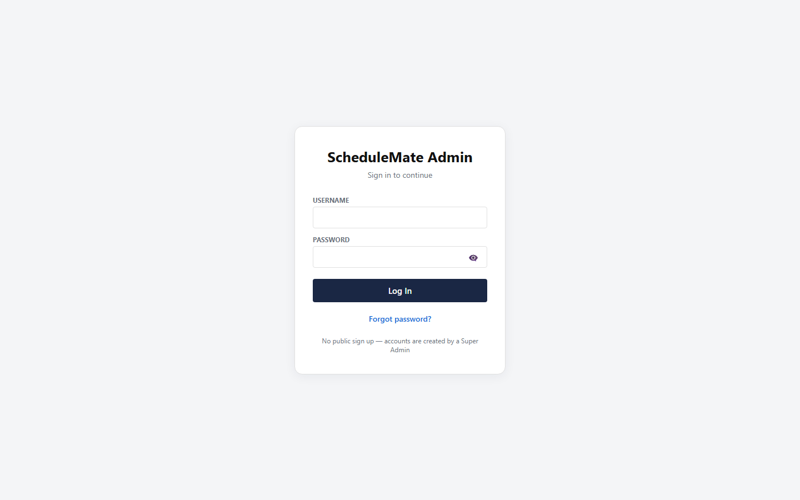

**Dashboard** — live stats, weekly chart, status breakdown, recent activity and today's schedule

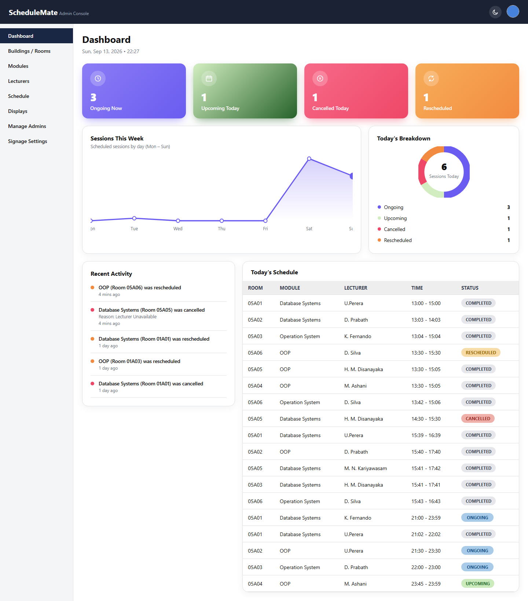

**Account menu** — quick access to Profile and Logout from any page

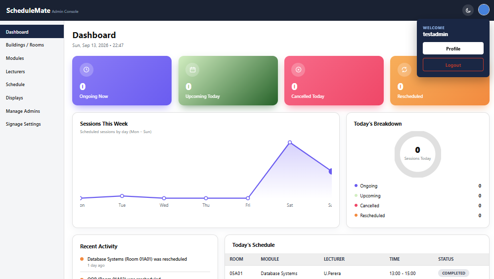

**Buildings / Rooms** — campus structure management

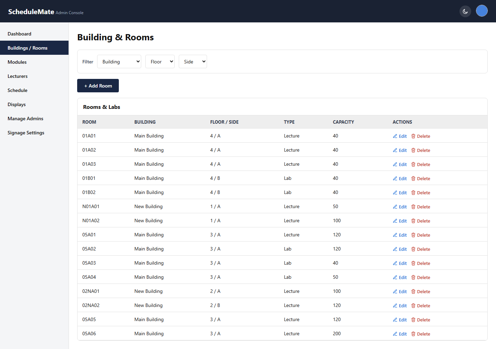

**Modules**

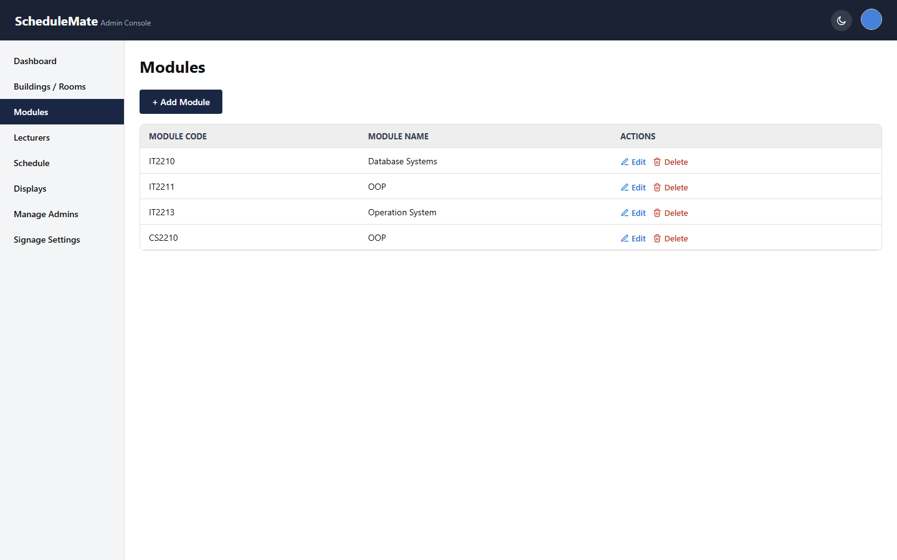

**Lecturers**

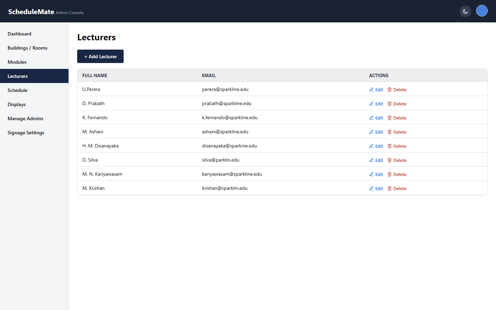

**Schedule** — create, edit, cancel and reschedule sessions with conflict validation

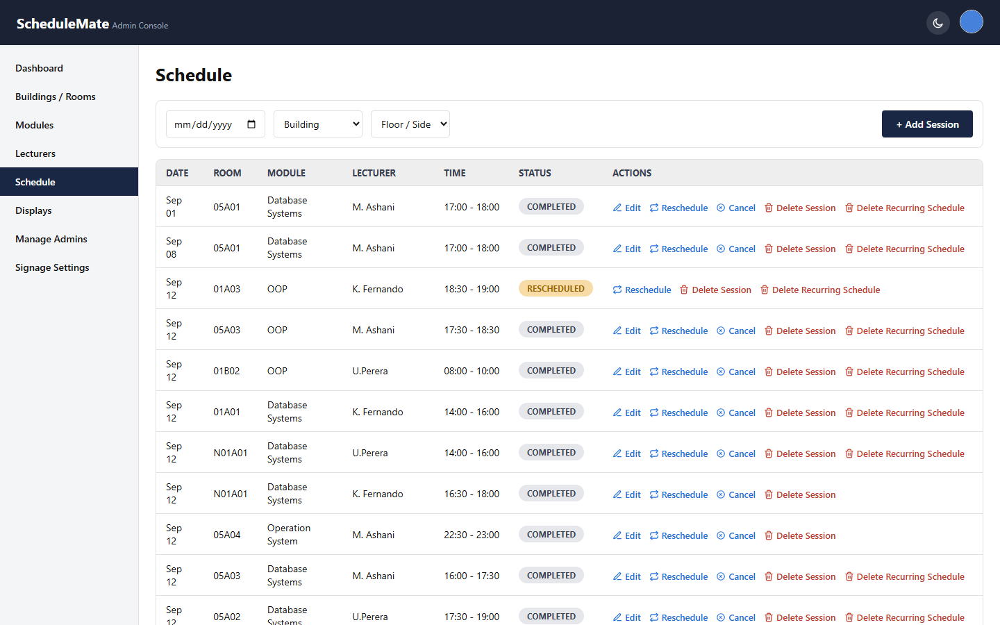

**Display Devices** — Active / Inactive control per device

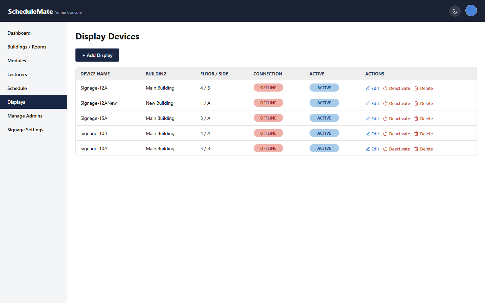

**Manage Admins**

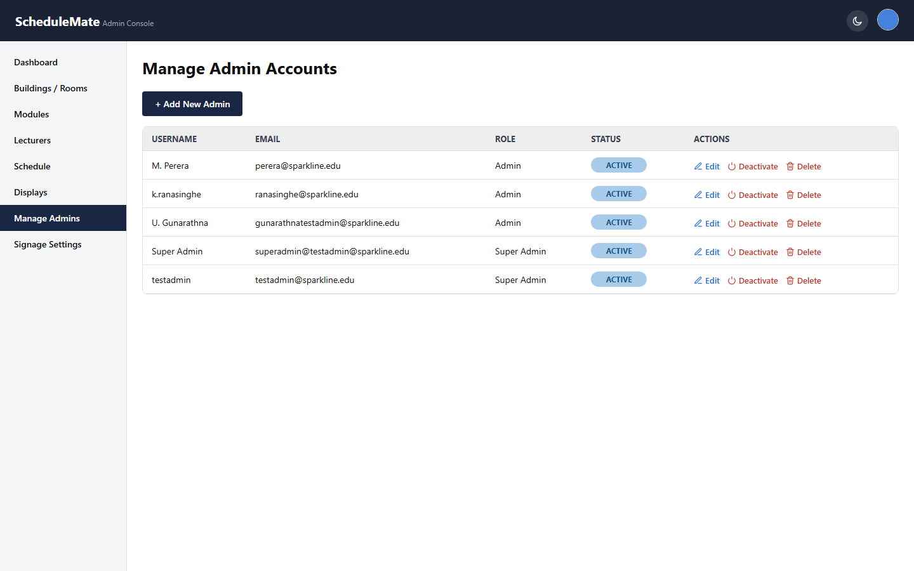

**Signage Settings**

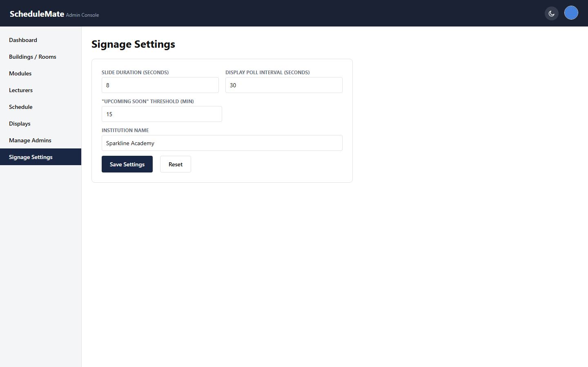

**My Profile** — with profile picture upload

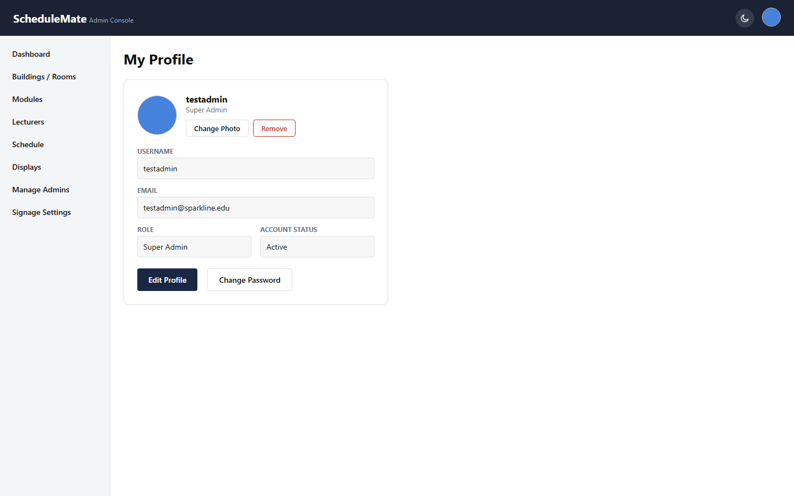

### Signage Display 

**Live clock** — the header clock now ticks with seconds (`HH:MM:SS`)

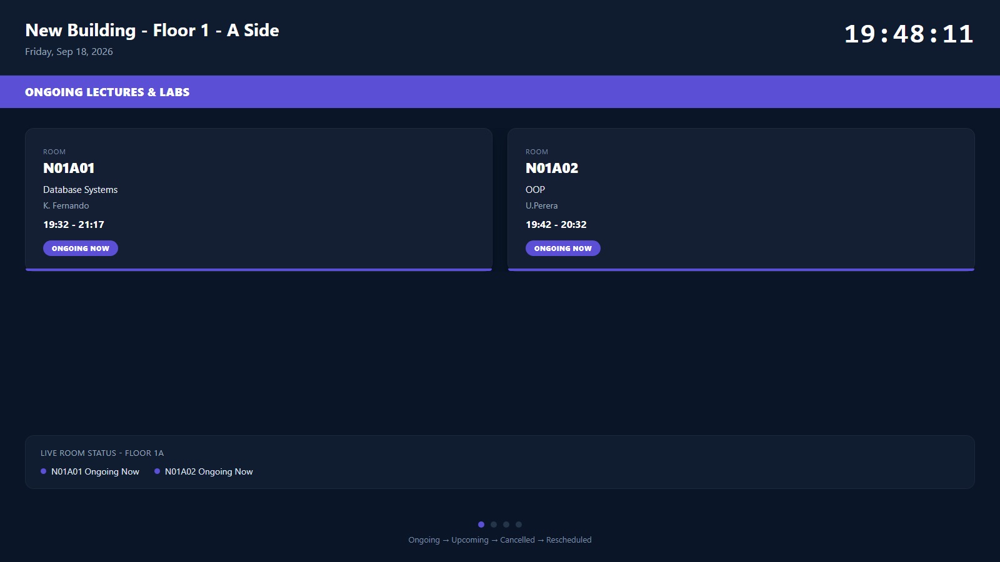

**Single-card slide** — a lone card keeps the same size as one card in a 2-card row, instead of stretching to fill the screen

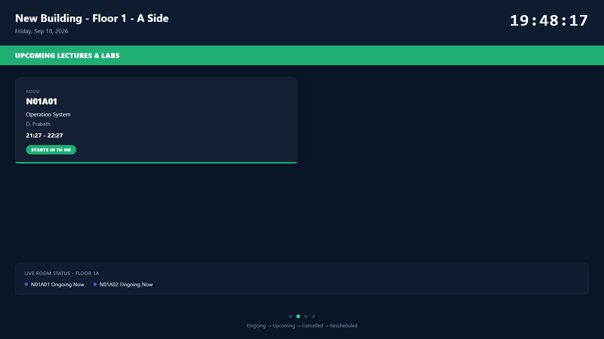

---

## Tech Stack

- **Backend:** Node.js, Express 5, TypeScript, Prisma ORM, PostgreSQL, JWT auth, bcrypt, Multer (file uploads)
- **Frontend (both apps):** React 19, TypeScript, Vite, React Router, Axios (admin-web)
- **Database:** PostgreSQL

---

## Project Structure

```
ScheduleMate-Lecture-Hall-Digital-Signage-System_Chathuranganee/
├── apps/
│   ├── api/                  # Express + Prisma backend
│   │   ├── prisma/
│   │   │   ├── schema.prisma
│   │   │   ├── migrations/
│   │   │   └── seed.ts       # creates the default super-admin account
│   │   └── src/
│   │       ├── routes/       # one router per resource (sessions, displays, signage, ...)
│   │       ├── middleware/
│   │       ├── lib/          # prisma client, floating-time helper, upload config
│   │       ├── app.ts
│   │       └── server.ts
│   ├── admin-web/            # Admin console (React + Vite), served on :5173
│   └── signage-display/      # Kiosk display app (React + Vite), served on :5174
├── docs/
│   └── screenshots/          # Screenshots used in this README
└── scripts/
    └── capture_screenshots.py
```

---

## Prerequisites

- [Node.js](https://nodejs.org/) v18 or later and npm
- [PostgreSQL](https://www.postgresql.org/) v14 or later, running locally (or a connection string to a hosted instance)

---

## Setup & Installation

### 1. Clone and install dependencies

Each app has its own `package.json`, so dependencies are installed per app:

```bash
git clone <repository-url>
cd ScheduleMate-Lecture-Hall-Digital-Signage-System_Chathuranganee
cd apps/api && npm install
cd ../admin-web && npm install
cd ../signage-display && npm install
```

### 2. Configure the backend environment

Create `apps/api/.env` with:

```env
PORT=4000
DATABASE_URL="postgresql://<user>:<password>@localhost:5432/schedulemate?schema=public"
JWT_SECRET="replace-with-a-long-random-string"
```

Create the database if it doesn't exist yet (e.g. `createdb schedulemate`).

### 3. Run migrations and seed the database

From `apps/api`:

```bash
npx prisma migrate deploy
npx prisma generate
npx prisma db seed
```

This creates all tables and inserts one default Super Admin account (`testadmin` / `password123` — see [Default Login](#default-login)). Buildings, rooms, modules, lecturers and sessions are created afterwards through the Admin Console UI.

> The admin-web and signage-display apps talk to the API at `http://localhost:4000` (see `apps/admin-web/src/lib/apiClient.ts` and `apps/signage-display/src/App.tsx`) — no `.env` file is needed for them in local development. If you deploy the API elsewhere, update `API_ORIGIN` / `API_BASE` in those two files.

---

## Running the Project

Run all three apps in separate terminals:

```bash
# Terminal 1 — API (http://localhost:4000)
cd apps/api
npm run dev
```

```bash
# Terminal 2 — Admin Console (http://localhost:5173)
cd apps/admin-web
npm run dev
```

```bash
# Terminal 3 — Signage Display (http://localhost:5174)
cd apps/signage-display
npm run dev -- --port 5174
```

Then open:
- Admin Console → [http://localhost:5173](http://localhost:5173)
- Signage Display → `http://localhost:5174/?side=<side_id>` (see [How the Signage Display Works](#how-the-signage-display-works))

---

## Default Login

After seeding, sign in to the Admin Console with:

| Username | Password | Role |
|---|---|---|
| `testadmin` | `password123` | Super Admin |

Change this password (or create additional admin accounts) from **My Profile** / **Manage Admins** after first login.

---

## Usage Guide

1. **Set up the campus structure first** — go to **Buildings / Rooms** and create your buildings, floors, sides and rooms. Rooms belong to a Side (e.g. "Main Building → Floor 3 → A Side"), which is the same grouping the signage screens use.
2. **Add Modules and Lecturers** from their respective pages.
3. **Register a Display Device** on the **Displays** page and assign it to a Building/Floor/Side. Each display corresponds to one physical screen mounted for that side of a floor.
4. **Schedule sessions** on the **Schedule** page — pick a room, module, lecturer, date and time (optionally weekly-recurring). The system blocks the save if the room, the lecturer, or the module already has an overlapping session at that time, and tells you exactly which existing session conflicts.
5. **Cancel or Reschedule** a session from the Schedule table's action icons; both require a reason and are recorded in the activity/audit trail shown on the Dashboard.
6. **Point a screen** at `http://<signage-host>:5174/?side=<side_id>` for the Side it's mounted on — it will automatically show that Side's Ongoing/Upcoming/Cancelled/Rescheduled sessions and keep itself up to date by polling the API.
7. **Deactivate a display** from the Displays page (e.g. for maintenance) to make its screen show "Display Inactive" instead of the schedule, without deleting its configuration.
8. Adjust slide timing and the "Upcoming Soon" threshold from **Signage Settings**.

---

## How the Signage Display Works

- Every physical screen is a browser pointed at `signage-display`'s URL with a `?side=<side_id>` query parameter, where `side_id` identifies one Building → Floor → Side (a group of rooms, e.g. the rooms on one side of one floor of one building).
- The app fetches `GET /api/signage/:side_id` from the API, which returns that side's sessions split into four categories — **Ongoing**, **Upcoming**, **Cancelled**, **Rescheduled** — along with the side's location label and a live per-room status strip.
- Slides rotate automatically (default every 8 seconds, configurable in Signage Settings) in a fixed order: all Ongoing pages, then all Upcoming pages, then all Cancelled pages, then all Rescheduled pages, then back to Ongoing.
- Each slide shows **at most 2 session cards**, laid out in a fixed 2-column grid so a single card is never stretched to fill the row — it stays the same size whether it's alone or paired with a second card. If a category has more than 2 sessions, they are shown 2-at-a-time across multiple pages of that same category (e.g. 10 Ongoing sessions → 5 pages of 2) before the rotation moves on to the next category — there is no limit on the total number of sessions that can be displayed this way.
- The API is polled on an interval (default 30 seconds, configurable) so a session created, edited, cancelled or rescheduled in the admin console appears on the physical screen shortly after, without reloading the page.
- If an admin marks the display **Inactive** on the Displays page, the feed responds with a 403 and the screen shows a dedicated "Display Inactive" message instead of any schedule data.
- **Switching a physical screen to show a different location** is done by changing the `?side=<id>` value in that screen's browser URL to the `side_id` of the Side you want it to show — the system does not automatically rotate one physical screen between multiple locations; one screen shows one Side at a time.

---

## API Overview

All endpoints are prefixed with `/api` (except the public signage feed and health check). Auth-protected routes require an `Authorization: Bearer <token>` header obtained from `/api/auth/login`.

| Resource | Base path | Notes |
|---|---|---|
| Auth | `/api/auth` | login, forgot/reset password |
| Buildings / Floors / Sides / Rooms | `/api/buildings`, `/api/floors`, `/api/sides`, `/api/rooms` | campus structure CRUD |
| Modules | `/api/modules` | |
| Lecturers | `/api/lecturers` | blocks delete if the lecturer has upcoming sessions |
| Sessions | `/api/sessions` | create/update/reschedule/cancel/delete, with room/lecturer/module conflict checks; supports weekly recurrence |
| Displays | `/api/displays` | device CRUD plus `/deactivate` and `/reactivate` |
| Admins | `/api/admins` | Super Admin only |
| Profile | `/api/profile` | current admin's own profile, incl. photo upload |
| Dashboard | `/api/dashboard` | aggregated stats for the Dashboard page |
| Signage Settings | `/api/signage-settings` | slide duration, poll interval, "Upcoming Soon" threshold, institution name |
| Signage Feed | `/api/signage/:side_id` | **public**, no auth — consumed by the kiosk display |
| Health | `/health` | basic liveness check |

---

## Known Limitations

- Session times are stored as literal "floating" clock values (not tied to a real timezone) — the whole system assumes the API server and all screens run in the same local timezone.
- The signage display URL for each screen is set manually via the `?side=` query parameter; there's no remote screen-management/pairing UI yet.
- File uploads (profile photos) are stored on local disk under `apps/api/uploads`, so they don't survive across multiple API server instances without a shared volume.

---

## Author

**S.S.M. Chathuranganee**
